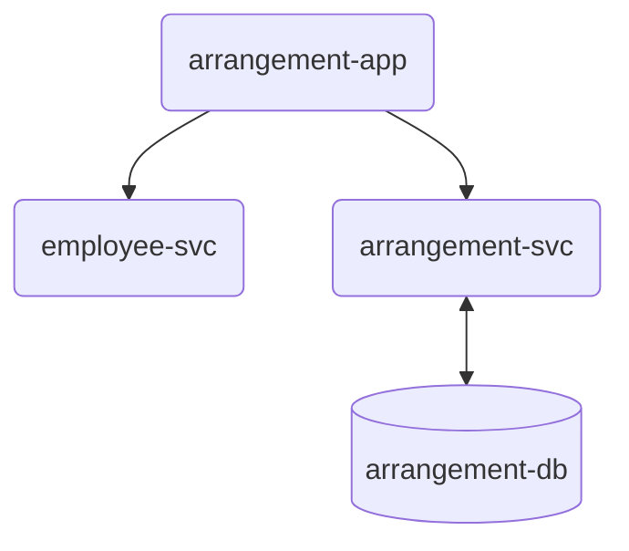

# Skjer - Arrangement backend/frontend

An F# service and frontend for collecting and maintaining data about events.

## Environments

- Development = https://skjer.bekk.dev/
- Production = https://skjer.bekk.no/

## Dependency graph



## Requirements

- .NET Core SDK 6.0
- SQL server

## Start local

### Your first F# project?

- Take a look at https://fsharp.org/use/mac/ to setup your develop environment.

### Run database locally

If you are using Docker, run:

```
docker compose up
```

If you are using Podman, install [podman-compose](https://github.com/containers/podman-compose#installation) and run:

```
podman-compose up
```

Make sure that you can connect to the database on localhost:1433 with the same credentials used in [`appsettings.Development.json`](Arrangement-Svc/appsettings.Development.json).

### Running the service

Developing locally you can either run the frontend on its own and proxy to the dev instance in AWS.
Or you can run both frontend and backend locally.

Running everything locally:

```
$ cd Frontend
$ npm i
$ npm start
```

In another:

```
$ cd Arrangement-svc
$ dotnet watch run
```

If you are only developing frontend you can use and environment variable to proxy to the dev environment

```
$ cd Frontend
$ export PROXY=https://skjer.bekk.dev
$ npm i
$ npm start
```

When running the backend you may not want to run the migrations each time.
If you do not want to run migrations you can use the environment variable: `NO_MIGRATION`.

```
$ NO_MIGRATION=true dotnet run
```

Alternatively you can export it so you do not have to type it each time:

```
$ export NO_MIGRATION=true
$ dotnet run
```

## Deploy app

### Deploy to development

When the program is deployed the frontend is built and hosted by the backend.
Look in the dockerfile to see how this works.

Push to the master branch will automatically deploy the app to development.
If you want a preview of the service then append `-preview` to the title of any PR you make.

### Deployment to production

Create a release from the master branch, and it should deploy to production.

## Technologies we use

Backend:

- F#
- [Giraffe](https://github.com/giraffe-fsharp/Giraffe) is the framework we use to setup the web application. It is an easy to use library which builds functional components on top of Kestrel. It also has extensive documentation.
- [Dapper](https://github.com/DapperLib/Dapper) is the ORM we are using. We went with plain Dapper here as we want to write SQL and escape any heavier ORM. This has some pros and cons, but has been working well for us.
- [FsToolkit.ErrorHandling](https://github.com/demystifyfp/FsToolkit.ErrorHandling) Is a library we use to better deal with Task and Result types. It allows us to remove some rightward drift (match case pyramids) and also simplify our error handling.

Frontend:

- TypeScript
- React
- Sass
- Lodash

## Trying endpoints

While there is no swagger in this project you can use any JetBrains product, like Rider, to test HTTP endpoints.
Open the `Requests.http` file and you can test from there.
Some of the end points require a JWT authorized token, you can add this to the `http-client.env.json` file.

## Tests

The testing framework we use is [XUnit](https://github.com/xunit/xunit).

Mock data is created using [Bogus](https://github.com/bchavez/Bogus).

As this system has some endpoints under authentication, some which are open and others which can only be accessed with special tokens or based on certain event characteristics (if it is an external event, for example) the tests in this system test the endpoints and the database themselves.

This is done to try and ensure that the constraints we have set are actually upheld.

In order to do this the tests need a running database and a token in order to be run.
As we are using MSSQL database and that does not support an in-memory variant, a docker image is needed.
We did consider using an Sqlite in-memory database, but we went with the docker image so the test and production system use the same database.

The authentication itself has been mocked in `Tests/AuthHandler.fs`.
This allows us to set up authenticated clients with any claims as well as unauthenticated clients.

If you have a running database on your system, you could use that, but we recommend starting one just for testing, and deleting it after.
Running the tests will create a new image and database just for testing, and reuse that instance for later test sessions for performance reasons.

Environment variables:

- `NO_CONTAINER_MANAGEMENT` : Don't try to manage test container. Assumes it's up and running.
- `ARRANGEMENT_SVC_CONTAINER_MANAGER` : Program used for managing the container. Default is `podman`, but `docker` works fine too.
- `ARRANGEMENT_SVC_TESTCONTAINER` : Container name.

To run tests:

```
$ dotnet test
```

Running tests on changes is also supported by running `dotnet watch run --project Tests`

It's possible to disable podman integration to avoid requiring sudo password and migrations.

```
$ NO_CONTAINER_MANAGEMENT=1 NO_MIGRATION=1 dotnet # .. rest as before
```

### If you have problems getting to run the tests locally
I recommend the following steps:

1. Turn off any podman or docker containers running on port 1433 (`$ podman stop <containerId>`). This is usually the local database.
2. Run `$ podman-compose up`. Check `docker-compose.yml` to see which containers are started for this.
3. In a different terminal window, navigate to `/Arrangement-Svc` and start the backend with `$ dotnet run` to force a DB migration.
4. Close/stop the server.
5. Navigate back to root, and run tests with the following command: `$ NO_CONTAINER_MANAGEMENT=1 NO_MIGRATION=1 dotnet test`

You can keep running the tests with `$ NO_CONTAINER_MANAGEMENT=1 NO_MIGRATION=1 dotnet test` or directly in your IDE.

When finished testing you can remove the containers for testing by using `$ podman kill <containerId>` and `$ podman rm <containerId>`.

## Migrating the database

- Create a new .sql file with a number prefix (increment the highest existing prefix) with your new migration
- Run `$ dotnet run`

## Shortnames

Shortnames is a way to change the URL of an event.
Events are unique in the database, so only 1 row can have a specific shortname at any given time.

A typical event URL is `https://skjer.bekk.no/events/84427e54-54cd-4a74-8a53-cb0e4cc97004` with a shortname however you can replace the GUID with a string -> `https://skjer-dev.bekk.no/events/my-event`.
Shortnames are added when creating or editing an event.
A shortname can only be taken if:

- It is not currently used by an active event.
- The event that has it has ended (`endDate` in the past).
- The event that has it is cancelled.

## EventType and IsPubliclyAvailable

When the new bekk.no was launched, a desire to show our events on that site was expressed.
Which events that should be shown to the public should follow some constraints:

- No social events
- No hidden events
- Both external and internal events
-- Need to be able to hide faglige, internal events

To satisfy these constraints, `EventType` (`Faglig` og `Sosialt`) and `IsPubliclyAvailable` (`boolean`) was added.


